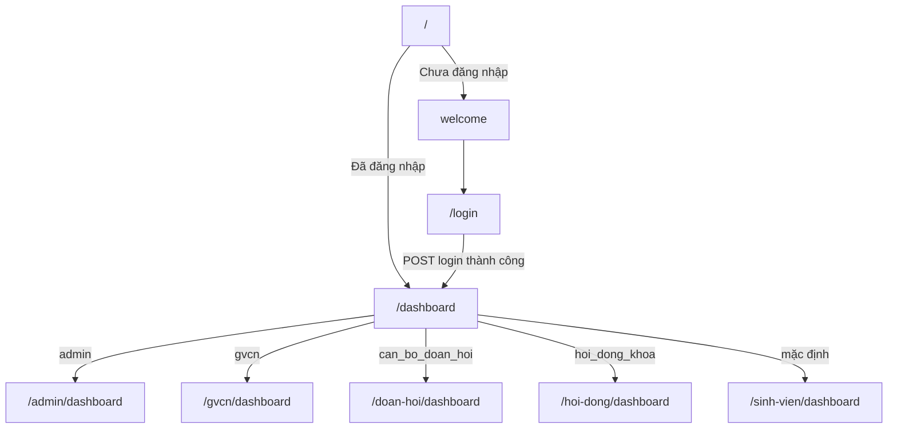
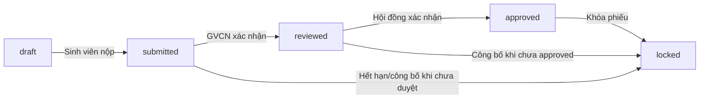
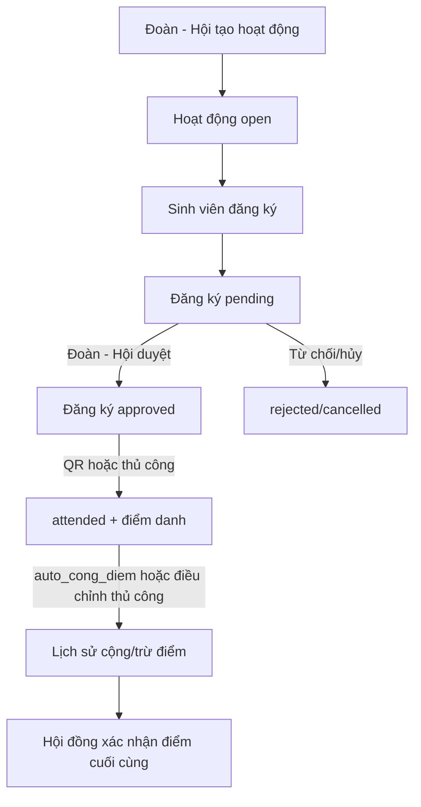

# Flow Chức Năng Và Redirect

Tài liệu này mô tả người dùng đi từ page nào sang page nào, và các form/action sẽ redirect về đâu sau khi xử lý.

## Flow Tổng Quát

## Xác Thực Và Tài Khoản

| Từ page | Hành động | Route xử lý | Redirect/kết quả |
| --- | --- | --- | --- |
| `/` | Người dùng chưa đăng nhập mở trang chủ | `GET /` | Hiển thị `welcome`. |
| `/` | Người dùng đã đăng nhập mở trang chủ | `GET /` | Redirect đến `/dashboard`. |
| `welcome` | Bấm Đăng nhập | `GET /login` | Hiển thị form đăng nhập. |
| `/login` | Submit đăng nhập | `POST /login` | Redirect đến intended URL hoặc `/dashboard`. |
| `/forgot-password` | Submit email reset | `POST /forgot-password` | Quay lại chính page với status hoặc lỗi. |
| `/reset-password/{token}` | Submit mật khẩu mới | `POST /reset-password` | Thành công redirect `/login`; lỗi quay lại form. |
| `/verify-email` | Gửi lại email xác thực | `POST /email/verification-notification` | Quay lại hoặc redirect dashboard nếu đã xác thực. |
| `/verify-email/{id}/{hash}` | Mở link xác thực email | `GET /verify-email/{id}/{hash}` | Redirect intended URL hoặc `/dashboard?verified=1`. |
| `/confirm-password` | Submit mật khẩu xác nhận | `POST /confirm-password` | Redirect intended URL hoặc `/dashboard`. |
| Shell/dropdown | Mở hồ sơ | `GET /profile` | Hiển thị page hồ sơ. |
| `/profile` | Cập nhật hồ sơ | `PATCH /profile` | Redirect lại `/profile`. |
| `/profile` | Xóa tài khoản | `DELETE /profile` | Đăng xuất, xóa user, redirect `/`. |
| Shell/dropdown | Đăng xuất | `POST /logout` | Redirect `/`. |

## Dashboard Theo Role

| Role | Từ `/dashboard` redirect đến |
| --- | --- |
| `admin` | `/admin/dashboard` |
| `gvcn` | `/gvcn/dashboard` |
| `can_bo_doan_hoi` | `/doan-hoi/dashboard` |
| `hoi_dong_khoa` | `/hoi-dong/dashboard` |
| Role khác/mặc định | `/sinh-vien/dashboard` |

## Admin

### Quản Lý Đợt Đánh Giá

| Từ page | Hành động | Route xử lý | Redirect/kết quả |
| --- | --- | --- | --- |
| `/admin/dashboard` hoặc sidebar | Mở danh sách đợt | `GET /admin/dot-danh-gia` | Hiển thị danh sách đợt đánh giá. |
| `/admin/dot-danh-gia` | Bấm Tạo | `GET /admin/dot-danh-gia/create` | Hiển thị form tạo đợt. |
| `/admin/dot-danh-gia/create` | Submit tạo | `POST /admin/dot-danh-gia` | Redirect `/admin/dot-danh-gia`. |
| `/admin/dot-danh-gia` | Bấm Sửa | `GET /admin/dot-danh-gia/{dotDanhGia}/edit` | Hiển thị form sửa đợt. |
| `/admin/dot-danh-gia/{dotDanhGia}/edit` | Submit cập nhật | `PUT /admin/dot-danh-gia/{dotDanhGia}` | Redirect `/admin/dot-danh-gia`. |
| `/admin/dot-danh-gia` | Mở/đóng/công bố | `POST /open`, `/close`, `/publish` | Quay lại page hiện tại bằng `back()`. |

### CRUD Dữ Liệu Nền

Áp dụng cho các module: `users`, `roles`, `permissions`, `khoas`, `lops`, `sinh-viens`, `nam-hocs`, `hoc-kys`, `tieu-chis`, `muc-tieu-chis`, `minh-chungs`, `hoat-dongs`, `thong-baos`, `logs`, `backups`.

| Từ page | Hành động | Route xử lý | Redirect/kết quả |
| --- | --- | --- | --- |
| `/admin/dashboard` hoặc sidebar | Mở module | `GET /admin/{module}` | Hiển thị danh sách dữ liệu. |
| `/admin/{module}` | Bấm Thêm mới | `GET /admin/{module}/create` | Hiển thị form tạo. |
| `/admin/{module}/create` | Submit tạo | `POST /admin/{module}` | Redirect `/admin/{module}`. |
| `/admin/{module}` | Bấm xem | `GET /admin/{module}/{id}` | Hiển thị chi tiết. |
| `/admin/{module}` hoặc chi tiết | Bấm sửa | `GET /admin/{module}/{id}/edit` | Hiển thị form sửa. |
| `/admin/{module}/{id}/edit` | Submit cập nhật | `PUT /admin/{module}/{id}` | Redirect `/admin/{module}`. |
| `/admin/{module}` | Xóa | `DELETE /admin/{module}/{id}` | Quay lại page hiện tại bằng `back()`. |

## Sinh Viên

| Từ page | Hành động | Route xử lý | Redirect/kết quả |
| --- | --- | --- | --- |
| `/sinh-vien/dashboard` hoặc sidebar | Mở tự đánh giá | `GET /sinh-vien/phieu-danh-gia` | Hiển thị form đánh giá; nếu chưa/hết đợt thì hiển thị màn hình đóng. |
| `/sinh-vien/phieu-danh-gia` | Lưu điểm tự chấm | `PUT /sinh-vien/phieu-danh-gia` | Quay lại form bằng `back()`. |
| `/sinh-vien/phieu-danh-gia` | Nộp phiếu | `POST /sinh-vien/phieu-danh-gia/submit` | Quay lại form bằng `back()`, phiếu thành `submitted`. |
| `/sinh-vien/phieu-danh-gia` | Tải minh chứng | `POST /sinh-vien/phieu-danh-gia/minh-chung` | Quay lại form bằng `back()`. |
| `/sinh-vien/phieu-danh-gia` | In phiếu | `GET /sinh-vien/phieu-danh-gia/in` | Tải PDF, không redirect page. |
| Sidebar | Mở lịch sử điểm | `GET /sinh-vien/phieu-danh-gia/lich-su` | Hiển thị lịch sử điểm. |
| Sidebar | Mở hoạt động | `GET /sinh-vien/hoat-dong` | Hiển thị danh sách hoạt động đang mở. |
| `/sinh-vien/hoat-dong` | Đăng ký hoạt động | `POST /sinh-vien/hoat-dong/{hoatDong}/dang-ky` | Quay lại danh sách bằng `back()`. |
| QR hoạt động | Check-in | `GET /sinh-vien/hoat-dong/{hoatDong}/check-in?token=...` | Nếu token đúng, redirect `/sinh-vien/hoat-dong`. |
| Form/minh chứng | Tải minh chứng | `GET /minh-chung/{minhChung}/download` | Tải file, không redirect page. |

## GVCN/Cố Vấn

| Từ page | Hành động | Route xử lý | Redirect/kết quả |
| --- | --- | --- | --- |
| `/gvcn/dashboard` hoặc sidebar | Mở danh sách phiếu | `GET /gvcn/phieu-danh-gia` | Hiển thị phiếu của lớp phụ trách. |
| `/gvcn/phieu-danh-gia` | Bấm Xem | `GET /gvcn/phieu-danh-gia/{phieu}` | Hiển thị chi tiết phiếu. |
| `/gvcn/phieu-danh-gia/{phieu}` | Lưu điểm GVCN | `PUT /gvcn/phieu-danh-gia/{phieu}` | Quay lại chi tiết bằng `back()`. |
| `/gvcn/phieu-danh-gia/{phieu}` | Xác nhận GVCN | `POST/PUT /gvcn/phieu-danh-gia/{phieu}/xac-nhan` | Quay lại chi tiết bằng `back()`, phiếu thành `reviewed`. |
| `/gvcn/phieu-danh-gia/{phieu}` | Duyệt minh chứng | `POST /gvcn/minh-chung/{minhChung}/duyet` | Quay lại chi tiết bằng `back()`. |
| `/gvcn/phieu-danh-gia/{phieu}` | Tải minh chứng | `GET /minh-chung/{minhChung}/download` | Tải file nếu thuộc lớp phụ trách. |

## Đoàn - Hội

| Từ page | Hành động | Route xử lý | Redirect/kết quả |
| --- | --- | --- | --- |
| `/doan-hoi/dashboard` hoặc sidebar | Mở hoạt động | `GET /doan-hoi/activities` | Hiển thị danh sách hoạt động. |
| `/doan-hoi/activities` | Bấm Tạo hoạt động | `GET /doan-hoi/activities/create` | Hiển thị form tạo. |
| `/doan-hoi/activities/create` | Submit tạo | `POST /doan-hoi/activities` | Redirect `/doan-hoi/activities`. |
| `/doan-hoi/activities` | Bấm sửa | `GET /doan-hoi/activities/{hoatDong}/edit` | Hiển thị form sửa. |
| `/doan-hoi/activities/{hoatDong}/edit` | Submit cập nhật | `PUT/PATCH /doan-hoi/activities/{hoatDong}` | Redirect `/doan-hoi/activities`. |
| `/doan-hoi/activities` | Xóa hoạt động | `DELETE /doan-hoi/activities/{hoatDong}` | Quay lại page hiện tại bằng `back()`. |
| `/doan-hoi/activities` | Xem đăng ký/điểm danh | `GET /doan-hoi/activities/{hoatDong}/registrations` | Hiển thị danh sách đăng ký. |
| `/doan-hoi/activities/{hoatDong}/registrations` | Duyệt/từ chối/hủy đăng ký | `POST /doan-hoi/registrations/{registration}/approve` | Quay lại page đăng ký bằng `back()`. |
| `/doan-hoi/activities/{hoatDong}/registrations` | Điểm danh thủ công | `POST /doan-hoi/activities/{hoatDong}/attendance` | Quay lại page đăng ký bằng `back()`. |
| `/doan-hoi/activities/{hoatDong}/registrations` | Điều chỉnh điểm thủ công | `POST /doan-hoi/activities/{hoatDong}/manual-adjust` | Quay lại page đăng ký bằng `back()`. |
| `/doan-hoi/activities` hoặc registrations | Xem QR | `GET /doan-hoi/activities/{hoatDong}/qr` | Hiển thị QR/link check-in cho sinh viên. |
| `/doan-hoi/activities/{hoatDong}/qr` | Bấm quay lại | Link view | Về `/doan-hoi/activities/{hoatDong}/registrations`. |

## Hội Đồng Khoa/Công Tác Sinh Viên

| Từ page | Hành động | Route xử lý | Redirect/kết quả |
| --- | --- | --- | --- |
| `/hoi-dong/dashboard` hoặc sidebar | Mở xác nhận điểm | `GET /hoi-dong/phieu-danh-gia` | Hiển thị phiếu `reviewed`, `approved`, `locked`. |
| `/hoi-dong/phieu-danh-gia` | Bấm Xem | `GET /hoi-dong/phieu-danh-gia/{phieu}` | Hiển thị chi tiết phiếu. |
| `/hoi-dong/phieu-danh-gia/{phieu}` | Lưu điểm Hội đồng | `PUT /hoi-dong/phieu-danh-gia/{phieu}` | Quay lại chi tiết bằng `back()`. |
| `/hoi-dong/phieu-danh-gia/{phieu}` | Xác nhận cuối cùng | `POST/PUT /hoi-dong/phieu-danh-gia/{phieu}/xac-nhan` | Quay lại chi tiết bằng `back()`, phiếu thành `approved`. |
| `/hoi-dong/phieu-danh-gia/{phieu}` | Khóa phiếu | `POST /hoi-dong/phieu-danh-gia/{phieu}/khoa` | Quay lại chi tiết bằng `back()`, phiếu thành `locked`. |
| Sidebar | Xuất Excel | `GET /hoi-dong/export/excel` | Tải `diem-ren-luyen.xlsx`. |
| Sidebar | Xuất PDF | `GET /hoi-dong/export/pdf` | Tải `bao-cao-diem-ren-luyen.pdf`. |
| Sidebar | Mở đợt đánh giá | `GET /admin/dot-danh-gia` | Dùng chung flow quản lý đợt đánh giá nếu có role/quyền phù hợp. |

## Flow Nghiệp Vụ Điểm Rèn Luyện

## Flow Hoạt Động Và Điểm Danh

